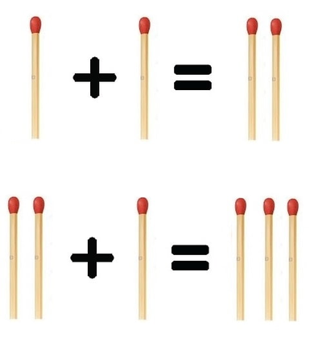

# Tuần 1.2 - Tăng tốc từ từ

## Progress
|ID   | Problem | Status 
|:---:|:---:|:---:|
|1 | [Số amstrong](#problem-1) | 	:white_check_mark: 
|2 |[Bán hàng](#problem-2)| :white_check_mark: 
|3 | [	Xử lý chuỗi](#problem-3) | :white_check_mark:
|4 | [	Ngôn ngữ của Lan](#problem-4)| :white_check_mark:
|5 | [	Rút gọn phân số](#problem-5)| :white_check_mark:
|6 | [Gọt dưa](#problem-6)| :white_check_mark:
|7 | [	Rạp phim](#problem-7) | :white_check_mark:
|8 | [Xếp domino](#problem-8) | :white_check_mark:
|9 | [Xếp que diêm](#problem-9) | :white_check_mark:
|10 | [	Chuỗi bằng nhau](#problem-10) | :white_check_mark:
|11 | [Chuỗi nghịch đảo](#problem-11) | :white_check_mark:

## Problem 1:
### [Số amstrong](So_Armstrong.py)
**Time limit per test: ... second**

**Memory limit per test: ... megabytes**

Kiểm tra Số Armstrong (Số Armstrong là số có **K** chữ số và tổng lũy thừa bậc **K** của các chữ số bằng chính nó)

**INPUT**

Một số nguyên không âm

**OUTPUT**

Xuất **True** nếu số nhập vào là số Armstrong, ngược lại **False**

| Input | Output |
|:---:|:---:|
| 153 | True|

## Problem 2: 
### [Bán Hàng](Ban_Hang.py)
**Time limit per test: ... second**

**Memory limit per test: ... megabytes**

Nam đang là quản lí một cửa hàng nhỏ trong thị trấn. Cửa hàng của Nam có **n** hàng hóa, mỗi hàng hóa thứ **i** có giá **ai**
đồng,

Mỗi ngày, có rất nhiều khách hàng ghé cửa hàng của Nam và liên tục hỏi giá của từng sản phẩm. Do có quá nhiều hàng hóa nên Nam không thể nào nhớ hết giá của chúng. Vì thế, Nam đã quyết định bán đồng giá tất cả các hàng hóa trong cửa hàng của mình.

Tuy nhiên, để không lỗ vốn, Nam muốn sau khi tất cả **n** hàng hóa trong cửa hàng được bán hết thì thu được tổng số tiền **bằng (hoặc lớn hơn)** so với tổng giá hàng hóa bán với giá gốc.

Mặt khác, Nam không muốn mất khách nếu giá bán quá lớn. Vì vậy, Nam phải bán **n** hàng hóa với giá **tối thiểu** sao cho tổng số tiền thu được sau khi bán hết hàng hóa có trong cửa hàng phải **bằng (hoặc lớn hơn tối thiểu)** so với tổng giá hàng hóa bán với giá gốc.

Với mỗi testcase các bạn hãy giúp Nam tìm ra giá bán phù hợp.

**INPUT**

Dòng đầu tiên là một số nguyên **q(1≤q≤100)**— số lượng testcase. Theo sau mỗi **q** dòng là:

Dòng đầu tiên của testcase là một số nguyên **(1≤q≤100)** — số lượng hàng hóa. Dòng thứ hai 
gồm **n**  số nguyên **a1,a2,...,an(1≤ai≤107)** —  **ai** giá gốc của hàng hóa thứ **i**.

**OUTPUT**

Với mỗi testcase in ra giá bán đồng giá tối thiểu của n hàng hóa sao cho tổng số tiền thu được sau 
khi bán hết hàng hóa có trong cửa hàng phải **bằng (hoặc lớn hơn tối thiểu)** so với tổng giá hàng hóa bán 
với giá gốc.

VÍ DỤ:

| Input | Output |
|:---|:---:|
| 3   5   1 2 3 4 5   3   1 2 2   4   1 1 1 1 |3     2     1|

## Problem 3:
### [Xử lý chuỗi](Xu_Ly_Chuoi.py)
**Time limit per test: ... second**

**Memory limit per test: ... megabytes**

Bob đang tham dự một lớp học lập trình. Bài tập đầu tiên của Bob là viết một chương trình đơn giản. 
Chương trình sẽ yêu cầu nhập một chuỗi, sau đó nếu có chữ viết hoa trong chuỗi thì thay thế chúng 
bằng những chữ viết thường. Xóa hết tất cả các nguyên âm và chèn dấu "." trước mỗi phụ âm có trong
chuỗi đó.

Biết nguyên âm là những kí tự "A","O","Y","E","U","I", và những kí tự còn lại là phụ âm. Chương trình 
sẽ nhận đầu vào là mỗi chuỗi và đầu ra là một chuỗi sau khi xử lí những yêu cầu trên.

Bob đang loay hoay không biết làm bài này như thế nào. Bạn hãy giúp Bob nhé.

**INPUT**

Dòng đầu tiên là một chuỗi gồm những cữ cái Latin viết hoa và viết thường, có độ dài từ 1 đến 100.

**OUTPUT**

Chuỗi kết quả.

VÍ DỤ:

| Input | Output |
|:---|:---|
| tour | .t.r|
|aBAcAba |	.b.c.b |
| pyThon |.p.t.h.n|

## Problem 4:
### [Ngôn ngữ của Lan](Ngon_Ngu_Cua_Lan.py)
**Time limit per test: ... second**

**Memory limit per test: ... megabytes**

Lan đang học ở một trường ngoại ngữ ở Tp.HCM. Lan rất yêu thích ngôn ngữ, đặc biệt là ngữ pháp. 
Khi  bước vào năm thứ 3, Lan quyết định tạo ra một ngôn ngữ mới dễ sử dụng nhất có thể đủ để 
nói chuyện với bạn bè. Ngôn ngữ mới của Lan có tên là Lan's Language và thỏa theo những ngữ pháp sau:

  - Có 3 loại từ trong Lan's Language: danh từ, động từ và tính từ. Mỗi từ trong Lan's Language thuộc một trong 3 loại từ đó.
  
  - Có 2 giới tính: Nam và Nữ. Mỗi từ trong Lan's Language thuộc một trong 2 giới tính đó.
  
  - Tính từ nam là những từ kết thúc với -lios và Tính từ nữ là những từ kết thúc với -liala.
  
  - Danh từ nam là những từ kết thúc với -etr và  Danh từ nữ là những từ kết thúc với -etra.
  
  - Động từ nam là những từ kết thúc với -initis và  Động từ nữ là những từ kết thúc với -inites.
  
  - Các từ trong Lan's Language luôn kết thúc bằng 1 trong các đuôi trên.
  
  - Các từ mà chỉ có mỗi đuôi như "lios", "liala", "etr"... cũng thuộc Lan's Language.
  
  - Không có dấu câu, ngữ pháp chia thì và các dạng biến đổi từ trong Lan's Language.
  
  - Một câu trong Lan's Language là một từ hợp lệ (thỏa những tính chất trong Lan's Language) hoặc là một mệnh đề hợp lệ.
  
Một mệnh đề hợp lệ trong Lan's language phải thỏa 2 điều kiện sau:

  Những từ trong mệnh đề phải hợp lệ và được sắp xếp theo thứ tự: Tính từ + Danh từ + Động từ. 
  Trong đó: Tính từ có thể có 1 hoặc nhiều hoặc không có nhưng phải đứng trước Danh từ. Chỉ có
  duy nhất một Danh từ trong câu. Động từ có thể có 1 hoặc nhiều hoặc không có nhưng phải
  đứng sau Danh từ.
  
  Tất cả các từ trong mệnh đề phải cùng giới tính.
Cho một câu gồm một chuỗi các từ, nhiệm vụ của bạn là viết một chương trình kiểm tra xem câu được nhập vào có thỏa mãn 
những tính chất của Lan's language hay không? 

**OUTPUT**

Nếu câu nhập vào thỏa mãn những tính chất của Lan's language, xuất YES
Ngược lại xuất NO

VÍ DỤ:

| Input | Output |
|:---:|:---:|
| petr| YES|
| etis atis animatis etis atis amatis | NO|
| nataliala kataliala vetra feinites | YES|

## Problem 5:
### [Rút Gọn Phân Số](Rut_Gon_Phan_So.py)
**Time limit per test: ... second**

**Memory limit per test: ... megabytes**

Viết chương trình rút gọn phân số.

**INPUT**

Dòng đầu tiên là một số nguyên **n(1≤n≤100)** — Số lượng phân số cần rút gọn

n dòng tiếp theo là hai số nguyên **a,b(a,b≥1) — a,b** lần lượt là tử số và mẫu số.

**OUTPUT**

Ứng với **n** dòng, in ra theo thứ tự **tử số** và **mẫu số** (cách nhau một khoảng trắng) sau khi rút gọn; mẫu số
chỉ được in khi lớn hơn 1.

**VÍ DỤ:**

| Input | Output |
|:---|:---:|
| 5 6 8 3 7 5 10 10 5  25 100 | 3 4  3 7 1 2 2 1 4|

## Problem 6: 
### [Gọt Dưa](Got_Dua.py)
**Time limit per test: ... second**

**Memory limit per test: ... megabytes**

An và Bình rất thích ăn dưa hấu vì thế họ đi ra chợ chọn mua một trái to và chín nhất.  Về đến nhà, một 
vấn đề nảy sinh đó là việc chia phần trái dưa hấu cho cả 2, không chỉ thế, do 2 người bạn chỉ thích những 
con số chẵn, vì thế cần chia quả dưa hấu làm sao cho mỗi phần có khối lượng là một con số chẵn. Hãy 
giúp An và Bình kiểm tra xem có thể chia quả dưa hấu này hay không.

**INPUT**

Một số nguyên không âm

**OUTPUT**

Xuất **YES** nếu có thể chia, ngược lại **NO**

**VÍ DỤ:**

| **INPUT** | **OUTPUT** |
|:---:|:---:|
| **8** | **YES**|

## Problem 7:
### [Rap Phim](Rap_Phim.py)
**Time limit per test: ... second**

**Memory limit per test: ... megabytes**

Một rạp phim có diện tích sàn là n x m. Nhân lễ kỉ niệm, người ta cần lót gạch cho sàn của rạp bằng các 
viên gạch hình vuông với cạnh có kích thước là a. Xác định số lượng viên gạch cần ít nhất để phủ toàn 
bộ sàn, biết rằng diện tích toàn bộ số gạch được dùng có thể lớn hơn diện tích thực tế của sàn và 
các viên gạch phải được giữ nguyên, không được cắt ra.

**INPUT**

Ba số nguyên dương **n**, **m**, **a**

**OUTPUT**

Số lượng gạch ít nhất cần để lót sàn.

**VÍ DỤ:**

|**INPUT** | **OUTPUT** |
|:---:|:---:|
| 6 6 4 | 4|

## Problem 8: 
### [Xếp Domino](Xep_Domino.py)
**Time limit per test: ... second**

**Memory limit per test: ... megabytes**

Có một tấm ván gồm MxN hình vuông. Thêm vào đó, có thêm một số lượng không giới hạn các mảnh 
domino với kích thước 2x1 hình vuông. Bạn được phép quay mảnh domino. Nhiệm vụ cần thực hiện là
xếp nhiều mảnh domino nhất lên tấm ván sao cho thỏa các điều kiện sau:

- Mỗi mảnh domino phủ toàn bộ 2 hình vuông

- Không có mảnh nào bị xếp chồng lên nhau

- Mỗi mảnh phải nằm toàn bộ trên mặt ván

Tìm số lượng lớn nhất domino có thể xếp lên tấm ván.

**INPUT**

Hai số nguyên dương M, N

**OUTPUT**

Số lượng tối đa mảnh domino có thể xếp được lên tấm ván

**VÍ DỤ**

|**INPUT** | **OUTPUT** |
|:---:|:---:|
| 2 4 | 4|
| 3 3 | 4|

## Problem 9: 
### [Xếp que diêm](Xep_Que_Diem.py)
**Time limit per test: ... second**

**Memory limit per test: ... megabytes**

Một phương trình đúng (PTĐ) được định nghĩa là phương trình có dạng  a + b = c , trong đó  a , b , c > 0 . 

Ví dụ: phương trình  2 + 2 = 4  (| | + | | = | | | |) và  1 + 2 = 3  (| + | | = | | |) là PTĐ.  

Còn  1 + 2 = 4  (| + | | = | | | |),  2 + 2 = 3  (| | + | | = | | |) và  0 + 1 = 1  ( + | = |) không phải là PTĐ.

Bây giờ bạn có **n** que diêm. Bạn muốn sử dụng tất cả số que diêm đó để xếp thành một PTĐ. Không may thay, có một số trường hợp bạn không thể xếp được nếu bạn dùng tất cả **n** que diêm. Nhưng nếu bạn ra chợ mua thêm **k** que diêm nữa thì bạn có thể xếp được.

Ví dụ,  **n** = 2 , bạn cần mua thêm 2 cây diêm nữa để xếp thành **| + | = | |**.

**n** = 5 , bạn cần mua thêm 1 cây diêm nữa để xếp thành **| | + | = | | |**.

**INPUT**

Dòng đầu tiên là một số nguyên  **q   ( 1 ≤ q ≤ 100 )**  — số lượng testcase.  
**q**  dòng tiếp theo, mỗi dòng là một số nguyên  **n   ( 2 ≤ n ≤ 10 9 )**  — số lượng que diêm có ban đầu.

**OUTPUT**

Với mỗi testcase xuất ra trên một dòng số lượng que diêm tối thiểu cần phải mua để có thể xếp thành PTĐ.

**VÍ DỤ**

|**INPUT** | **OUTPUT** |
|:---|:---|
|4  2 5 8 11 | 2  1  0  1|

## Problem 10: 
### [Chuỗi bằng nhau](Chuoi_Bang_Nhau.py)
**Time limit per test: ... second**

**Memory limit per test: ... megabytes**

Cho hai chuỗi  **s , t**  chỉ gồm những kí tự Latin và có độ dài bằng nhau. Bạn có thể thực hiện nhiều lần biến đổi trên hai chuỗi đó.  

Một phép biến đổi bạn được phép thay thế một kí tự ở vị trí bất kì trong chuỗi đó thành kí tự liền kề với nó (trái hoặc phải).  

Ví dụ: bạn có chuỗi  **s**  = "acbc", bạn có thể thực hiện những phép biến đổi sau:
- thay  ***s2 = s1*** , kết quả thu được: "aabc". 
-  thay  ***s1 = s2*** , kết quả thu được: "ccbc".
-   thay  ***s3 = s2***  hoặc  **s3 = s4** , kết quả thu được: "accc". 
-   thay  ***s2 = s3*** , kết quả thu được: "abbc". 
-   thay  ***s4 = s3*** , kết quả thu được: "acbb".  

Lưu ý: Bạn được phép thực hiện nhiều phép biến đổi trên cả 2 chuỗi  **s , t**.

Nhiệm vụ của bạn là sau khi thực hiện một loạt các phép biến đổi theo quy tắc trên cho hai chuỗi  **s**  và  **t**  thì ta có thể thu được hai chuỗi bằng nhau hay không?

**INPUT**

Dòng đầu tiên là một số nguyên  q   ( 1 ≤ q ≤ 100 )  — số lượng testcase. 
Với mỗi testcase theo sau bởi 2 dòng:  Dòng đầu tiên là một chuỗi  **s ( 1 ≤ | s | ≤ 100 )**  — chỉ gồm các chữ cái Latin viết thường.
Dòng thứ hai là một chuỗi  **t ( 1 ≤ | t | ≤ 100 , | t | = | s | )**  — chỉ gồm các chữ cái Latin viết thường.

**OUTPUT**

Ứng với mỗi testcase xuất trên 1 dòng. 

Nếu có thể biến hai chuỗi  **s**  và   **t**  thành chuỗi bằng nhau, xuất **YES**.

Ngược lại xuất **NO**

**VÍ DỤ**

|**INPUT** | **OUTPUT** |
|:---|:---|
|3 xabb aabx technocup technocup a  z| YES YES  NO|

## Problem 11: 
### [Chuỗi nghịch đảo](Chuoi_Nghich_Dao.py)
**Time limit per test: ... second**

**Memory limit per test: ... megabytes**

Kiểm tra 2 chuỗi nhập vào có phải là chuỗi nghịch đảo hay không.

**INPUT**

Dòng đầu tiên chứa chuỗi thứ nhất. Dòng kế tiếp chứa chuỗi thứ 2.

**OUTPUT**

Xuất YES nếu 2 chuỗi là nghịch đảo. Ngược lại, xuất NO.

**VÍ DỤ**

|**INPUT** | **OUTPUT** |
|:---|:---|
|binh     hnib| YES|
|wecode     codewe| NO|

