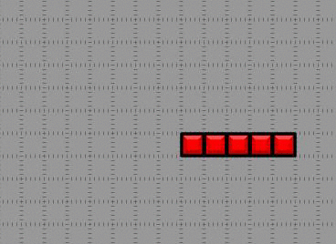
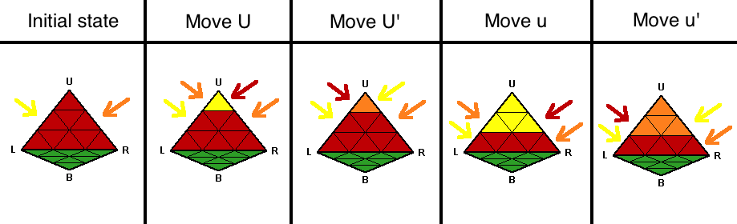
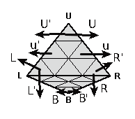
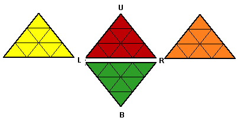
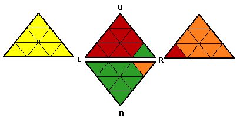
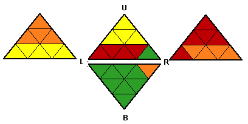
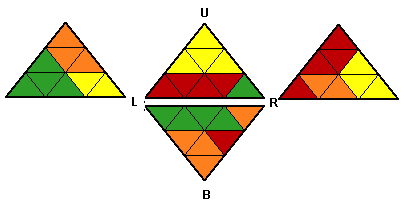
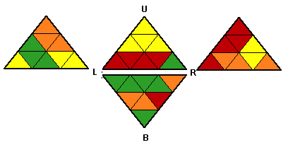

# Tuần 4.1 - Bài tập wecode cuối cùng

## Progress
|ID   | Problem | Status 
|:---:|:---:|:---:|
|1 | [		Wrap line](#problem-1) | 	:x:
|2 |[thợ sửa ống nước](#problem-2)| :white_check_mark: 
|3 | [		game con rắn](#problem-3) | :white_check_mark:
|4 | [	rubik tứ diện](#problem-4)| :x:

## Problem 1:
### 
# [	Wrap line](Wrap_line.py)
**Time limit per test: ... second**

**Memory limit per test: ... megabytes**

Xuất một hàng rất là dài ra màn hình thì thường rất khó đọc nên mặc định máy tính sẽ cắt một hàng quá dài thành nhiều hàng nhỏ sao cho vừa màn hình. Tuy nhiên nếu để console tự ngắt hàng thì đôi khi máy ngắt không được thông minh cho lắm. Giả sử màn hình chỉ hiển thị đẹp nhất được tối đa n ký tự, bạn hãy tự viết hàm xuất ngăt hàng theo nguyên tắc sau:

- Một từ được định nghĩa là dãy các ký tự không chứa khoảng trắng. Chương trình không bao giờ được ngắt hàng tại vị trí ở giữa một từ. Tức là dãy ký tự thuộc cùng một tự phải được xuất trên cùng một hàng
- Chương trình không bao giờ xuất quá n ký tự trên một hàng trừ khi việc này vi phạm quy tắc 1
- Chương trình phải xuất đầy đủ tất cả ký tự ra màn hình, kể cả khoảng trắng.
- Số hàng được ngắt ra là không giới hạn nhưng độ dài của những hàng vượt quá n phải là ngắn nhất có thể

Bấm link để down ví dụ:

**INPUT**

[Input](source/input.txt)

**OUTPUT**

[Output](source/output.txt)

## Problem 2: 
### [		Thợ sửa ống nước](Tho_sua_ong_nuoc.py)
**Time limit per test: ... second**

**Memory limit per test: ... megabytes**

Đường ống nước được ghép từ nhiều đoạn trong đó mỗi đoạn thuộc một trong 7 loại sau

- 1 : ống dọc

- 2 : ống ngang

- 3 – 6 : Ổng rẽ hướng

- 7 : Ống giao nhau (Dùng để nối 02 đường ống riêng rẽ cắt nhau)

Bức hình sau minh họa cho 7 loại ống theo thứ từ từ 1 đến 7:

Một trạm bơm có thể kết nối với tối đa 4 đường ống dẫn đi 4 hướng xung quanh. Trên bản đồ, trạm bơm được đánh dấu bằng chữ cái in hoa. Mỗi trạm bơm phải bơm nước đến tối đa 4 hồ chứa, được đánh dấu bằng chữ cái in thường tương ứng.

Hệ thống đường ống phải kết nối trạm bơm tới hồ chứa tương ứng và không bị rò rỉ. Bạn hãy viết chương trình kiểm tra hệ thống đường ống này.

**INPUT**

Dòng đầu tiên chứa số N, đây là số hàng trong bản đồ đường ống.

N dòng tiếp theo, mỗi dòng chứa một chuỗi ký tự. Các chuỗi ký tự này hợp thành bản đồ đường ống nước, mỗi ký tự đại diện cho một ô trên bản đồ.

**OUTPUT**

Nếu hệ thống đường ống kết nối được các trạm bơm tới các bể chứa tương ứng, xuất ra số ô thật sự có nước chảy qua khi hệ thống hoạt động

Nếu hệ thống không kết nối được các trạm bơm và bể chứa, xuất ra số -X. Trong đó X là số lượng các ô đã có nước chảy qua TRƯỚC KHI chỗ rò rỉ đầu tiên xảy ra hoặc nước chảy đến một bể chưa không tương ứng với trạm bơm.

VÍ DỤ:

| Input | Output |
|:---|:---:|
| 5 a224C22300000 0001643722B00 0b27275100000 00c7256500000 0006A45000000| 19|
| 7 0002270003777z24 3a40052001000101 1064000001000101 1006774001032501 1000001001010001 1010001001064035 6227206A0622Z250 |-48|
### ***GHI CHÚ***: 
Hệ thống đường ống trong ví dụ 1 có thể được minh họa bằng hình sau:

## Problem 3:
### [ Game con rắn](Game_con_ran.py)
**Time limit per test: ... second**

**Memory limit per test: ... megabytes**

Game con rắn [snake game](https://en.wikipedia.org/wiki/Snake_(video_game_genre)) là một trò chơi rất phổ biến kể từ thời điện tử băng. Một phiên bản game con rắn đơn giản được chơi trên một bảng hình chữ nhật, con rắn là một dãy các ô liên tiếp. Rắn luôn di chuyển về phía trước, có thể quẹo trái hoặc quẹo phải. Rắn sẽ bị chết nếu nó đụng vào chính phần thân của mình hoặc đi ra ngoài bảng.

Một trong những đặc điểm khiến game con rắn trở nên rất phổ biến là vì trò này cực kỳ dễ code. Màn hình game có thể dễ dàng được thể hiện bằng một mảng hai chiều, mỗi phần tử trong mảng là một ký tự. Những ô trống có thể được thể hiện bằng dấu chấm ***(".")***, thân rắn có thể được thể hiện bằng dấu sao ***"*"*** và đầu rắn, vốn cho biết rắn sẽ di chuyển về hướng nào, có thể được thể hiện bằng một trong 4 ký tự  ***< , ^ , > , v*** tương ứng với 4 hướng trái trên phải dưới.

Ở phiên bản hardcore nhất của trò chơi con rắn người chơi xác định hướng đi của rắn chỉ thông qua 03 lệnh cơ bản: Để rắp tiếp tục đi tới, cho rắn quay đầu sang phải, cho rắn qua đầu sang trái (chú ý là khi quay đầu rắn không di chuyển), ta có thể lưu trữ lại các lệnh này bằng một mảng ký tự trong đó ký tự ***F*** nghĩa là cho rắn đi tới 1 ô, ký tự ***R*** nghĩ là cho rắn quay đầu sang phải, ký tự ***L*** nghĩa là cho rắn quay đầu sang trái.

Cho một màn hình game và chuỗi lệnh của người dùng. Bạn hãy xác định trạng thái màn hình sau khi rắn thực hiện hết các lệnh trên.

**INPUT**

Dòng đầu tiên chứ 02 số ***n, m*** và ***c***, đây là kích thước của bảng

***n*** dòng tiếp theo, mỗi dòng chứa ***m*** ký tự như mô tả ở trên.

Dòng cuối cùng của input chứa ***c*** ký tự. Đây là chuỗi các lệnh của người dùng vào.

**OUTPUT**

Trạng thái của màn hình game khi rắn thực hiện hết chuỗi lệnh. Nếu rắn đã chết thì vẻ các mà xác rắn đang nằm là ký tự ***X***.
VÍ DỤ:

| Input | Output |
|:---|:---|
| 24 44 25  ............................................ ....................\*\*...................... ....................\*....................... ....................*....................... ....................*....................... ....................\*\*...................... .....................*...................... .....................\*\*..................... ......................\*\*.................... .......................*\*\*.................. .........................\**................. ..........................*\*................ ...........................*................ ..........................*\*................ .......................<*\*\*................. ............................................ ............................................ ............................................ ............................................ ............................................ ............................................ ............................................ ............................................ ............................................ FFRFFFFFFRRFFFFRFLRRLFFFF|............................................ ............................................ ............................................ ............................................ ............................................ ............................................ ............................................ .....................XX..................... .....................XXX.................... .....................X.XXX.................. .....................X...XX................. .....................X....XX................ .....................X.....X................ .....................X....XX................ .....................XXXXXX................. ............................................ ............................................ ............................................ ............................................ ............................................ ............................................ ............................................ ............................................ ............................................|
|8 13 32 ............. 
......****... 
.....^*..*... 
............. 
............. 
............. 
............. 
............. 
RFLFFFFFRFFFFLRFRFLFFFRLFRFLRRFF|	............. 
......XXXX... 
.....XX..X... 
............. 
............. 
............. 
............. 
............. |

## Problem 4:
### [rubik tứ diện]()
**Time limit per test: ... second**

**Memory limit per test: ... megabytes**

Chơi rubik khó quá mãi không giải được thế nên Bình muốn tìm hiểu thêm các biến thể đơn giản hơn của trò này. Bình bèn đi mua một cục Pyraminx, đây là một khối tứ diện, mỗi mặt có 9 mảnh màu. Khối tứ diện có 4 đỉnh, được ký hiệu lần lượ là U (đỉnh trên), R (đỉnh phải), L (đỉnh trái), and B (đỉnh phía sau). Mặt trước của khối tứ diện, mặt đối diện người chơi sẽ chứa 03 đỉnh là U, L và R.

Để tiện trao đổi với nhau, những người chơi pyraminx ký hiệu các bước xoay pyraminx theo cách sau:

- ***U*** - Xoay mặt ở tầng trên đỉnh ***120°*** theo chiều kim đồng hồ (Giả định rằng khi nhìn từ trên xuống thì đỉnh U là đỉnh trên cùng của khói tứ diện);
- ***U'*** - Xoay cùng đỉnh ***U*** nhưng theo chiều ngược chiều kim đồng hồ.
- ***u*** - Xoay 02 tầng trên cùng ***120°*** theo chiều kim đồng hồ.
- ***u'*** - Xoay 02 tầng trên cùng ngược chiều kim đồng hồ.

Các đỉnh khác cũng được ký hiệu tương tự:

Khối pyraminx mà Bình mua đã được xáo trộn sẵn và bán kèm với lời giải để đưa khối pyraminx đó về trạng thái gốc. Tuy nhiên, sau một lúc quay tới quay lui Bình đã đưa khối pyraminx về trạng thái "không biết đường nào mà lần" và chỉ còn một cách là tháo tung khối pyraminx ra rồi ráp lại cho các mặt cùng một màu.

Tuy nhiên Bình vẫn không muốn nản chí và vẫn muốn giải khối pyraminx này. Bây giờ Bình muốn tìm cách đưa khối pyraminx sau khi tháo ra ráp lại về trạng thái như được xáo trộn như lúc mới mua, dựa trên lời giải được bán kèm. Nghĩa là giả sử khối Pyraminx bây giờ có 4 màu là ***R (red), G (green), Y (yellow) và O (orange)*** lần lượt năm trên các mặt theo thứ tư: Mặt trước, dưới, mặt trái, mặt phải. Và lời giải bẵn sẵn là ***"B", "b'", "u'", "R"*** thì trạng thái ban đầu lúc mua của khối Pyraminx sẽ là

[['Y', 'Y', 'Y', 'Y', 'R', 'R', 'R', 'R', 'G'],
 ['G', 'R', 'O', 'O', 'O', 'G', 'G', 'G', 'G'],
 ['Y', 'O', 'Y', 'G', 'O', 'O', 'G', 'G', 'Y'],
 ['R', 'O', 'O', 'R', 'O', 'Y', 'Y', 'R', 'R']]

 Cụ thể:

Trạng thái đã tháo ra ráp lại:

Trước khi thực hiên phép xoay cuối cùng (phép R)

Trước đó 1 bước (trước khi xoay phép u')

Trước một bước nữa

Và trạng thái khi mua về là:

**INPUT**

- Dòng đầu tiên chứa 4 ký tự. Đây là 4 màu của khối pyraminx
- Dòng thứ hai chứa không quá 100 chuỗi. Mỗi chuỗi sẽ mang một trong các giá trị sau:

 {"U", "U'", "u", "u'", "L", "L'", "l", "l'", 
  "R", "R'", "r", "r'", "B", "B'", "b", "b'"}.

Input kết thúc bởi một hàng chỉ chứa dấu chấm hết (***.***)
**OUTPUT**

Xuất ra 4 hàng, mỗi hàng chứa 9 ký tự. Mỗi hàng là các màu trên một mặt của khối pyraminx, các mặt được xuất theo thứ tự: Mặt trước, Mặt dưới, Mặt trái, Mặt phải.

Trong mỗi hàng, các mảnh của khối pyraminx được đánh số theo thứ tự từ trên xuống dưới, từ trái qua phải bắt đầu từ đỉnh được đặt tên của mặt đó.

VÍ DỤ:

| Input | Output |
|:---|:---|
|R G Y O  B b' u' R .| Y Y Y Y R R R R G G R O O O G G G G Y O Y G O O G G Y R O O R O Y Y R R|
|A B C D l l' r' r u U u' R' L R L' B' U' b B b .|A A A A A A A A A D D D D B B B B B C C C B C C B B B D C D D C C D D|

