

  

<h1 align="center">
    
  **BÁO CÁO ĐỒ ÁN CUỐI KỲ**
  
  **PHÂN LOẠI THANH LONG XUẤT KHẨU**
  </h1>

## Giảng viên hướng dẫn:
    PGS.TS. Lê Đình Duy - duyld@uit.edu.vn
    Ths. Phạm Nguyễn Trường An - truonganpn@uit.edu.vn
 
## Thành viên thực hiện
| STT | Họ tên | MSSV | Vai trò | E-mail | Github |
| :---: | --- | --- | --- | --- | --- |
| 1 | Trần Phan Nhật Kha | 19521655 | Nhóm trưởng | 19521655@gm.uit.edu.vn | [trankha1655](https://github.com/trankha1655) |
| 2 | Trần Gia Nghĩa | 19521901 | Thành viên | 19521901@gm.uit.edu.vn | [SoulOfWindTGN](https://github.com/SoulOfWindTGN) |
| 3 | Võ Tá Lâm | 19521744 | Thành viên | 19521744@gm.uit.edu.vn | [volam2001](https://github.com/volam2001) |

## **overwrite**
* [Problem](#chương-1-tổng-quan)
* [Dataset](#chương-3-xây-dựng-bộ-dữ-liệu)
* [Method](#)
* [Predict & evaluate](#)
* [References](#)

# Chương 1: Tổng quan
## 1.1 Mô tả bài toán

Việt Nam hiện trồng rất nhiều loại trái cây thơm ngon, chất lượng cao đã được xuất khẩu, góp phần mang lại các giá trị cao về thương mại dịch vụ Logistic. Trong đó, thanh long hiện được đánh giá khá cao bởi tiềm năng rất tốt. Thanh long Việt Nam đang có tổng diện tích trồng và cho năng suất cao nhất châu Á. Song song đó, nước ta cũng là quốc gia xuất khẩu thanh long đứng hàng đầu thế giới. Thanh long là loại trái cây có tỷ trọng xuất khẩu cao nhất trong 3 tháng đầu năm 2021 của nước ta với tỷ trọng 34.1% (Nguồn: [Xuất khẩu rau quả tăng 9,5% trong 4 tháng đầu năm](https://vietnambiz.vn/xuat-khau-rau-qua-tang-95-trong-4-thang-dau-nam-20210513154103216.htm))

  

Việc xuất khẩu trái cây trong đó có thanh long cũng được lựa chọn khắc khe qua các tiêu chí phân loại phù hợp vói nhu cầu của từng thị trường. Để biết thêm chi tiết, có thể tham khảo bài viết sau: [TIÊU CHUẨN CỦA QUẢ THANH LONG XUẤT KHẨU SANG THỊ TRƯỜNG HIỆN NAY](https://ratracosolutions.com/n/tieu-chuan-thanh-long-xuat-khau-sang-thi-truong/)

Hiện nay, các vựa thanh long truyền thống trên cả nước phần lớn vẫn chưa cơ giới hóa khâu phân loại mà cần khá nhiều nhân lực cho khâu này. Đặc biệt trong tình hình dịch bệnh Covid 19 đang diễn biến khá phức tạp, khi nhiều tỉnh thành phía nam phải thực hiện giãn cách xã hội ngay trong mùa thu hoạch thanh long khiến cho việc tập trung nhiều nhân lục tại một địa điểm rất khó khăn. [Sản lượng thanh long ở nước ta tăng rất nhanh](https://nongnghiep.vn/viet-nam-tiep-tuc-la-nha-san-xuat-thanh-long-hang-dau-d264006.html) do nhu cầu xuất khẩu đến các nước ngày càng cao đòi hỏi cần cơ giới hóa nhiều quy trình nhằm tăng năng suất cũng như rút ngắn thời gian sản phẩm đến tay người tiêu dùng, trong đó có khâu phân loại.

🠊 ***Vì những nhu cầu thực tế trên, nhóm tiến hành nghiên cứu phương pháp phân loại trái thanh long thông qua hình ảnh bằng deep learning***

**1. Input của bài toán**

Ba ảnh trích xuất từ 3 góc của camera với độ phân giải mỗi ảnh là 720p (1280 x 720 pixels). Mỗi ảnh chụp một mặt của cùng một quả thanh long

  
   
  

Input ở trên dựa vào ngữ cảnh quả thanh long trên băng chuyền rửa quả thanh long. Từng trái thanh long sẽ lần lượt đi theo băng chuyền đi qua khu vực phân loại có đặt sẵn các camera với 2 camera nằm phía trên bên trái và bên phải cùng với một camera nằm ở dưới có ống kính hướng lên. Ánh sáng của ảnh được quay lúc trời quang đãng, ánh sáng rõ ràng, không quá chói.

**2. Output của bài toán**

Loại của quả thanh long (Ở bài toán này sẽ có 3 loại)

Dựa trên output có thể xây dựng hệ thống phân loại khi quả thanh long nằm trên băng chuyền ngay sau giai đoạn rửa sạch và làm khô. Ở khu vực phân loại được bố trí các camera, mỗi trái thanh long đi qua tầm quan sát của camera sẽ được thu nhận tín hiệu và xử lý để phân loại, sau đó thanh long sẽ được đưa vào một trong ba làn đi vào ba kho khác nhau.

## 1.2 Mô tả dữ liệu

- Dữ liệu của bài toán nằm ở một số vườn chuyên canh thanh long ở Bình Thuận. Trong quá trình thu thập dữ liệu, nhóm gặp phải nhiều khó khăn như việc chờ đợi mùa thu hoạch thanh long, thanh long khi được chụp phải vừa được cắt từ cây xuống để đảm bảo độ tươi (do các vựa thường phân loại ngay sau khi cắt từ cây xuống một khoảng thời gian không lâu) nên cần xin phép chủ vườn không gian và thời gian để thu thập dữ liệu.
- Bộ dữ liệu thanh long ở Việt Nam hiện chưa có ai thu thập nên số lượng dữ liệu mà nhóm có tương đối hạn chế do toàn bộ dữ liệu là tự thu thập và xử lý. Mục đích chính của việc tự thu thập dữ liệu của nhóm cũng xuất phát từ các đặc trưng sinh học nổi bật của giống thanh long ở Việt Nam có thể khác với các dữ liệu thanh long có sẵn của nước ngoài và đồng thời phù hợp ngữ cảnh ứng dụng của bài toán.

# Chương 2: Các nghiên cứu trước

Hiện nay, trong lĩnh vực thị giác máy tính nói riêng hay lĩnh vực máy học nói chung, các bài toán phân loại (classification) và nhận diện vật thể (object detection) có rất nhiều bài toán được đặt ra và đã được giải quyết. Những bài toán này được giải quyết bằng các mô hình machine learning và deep learning phổ biến như YOLO, VGG-16, Resnet-50 dựa trên kiến trúc mạng CNN (Convolutional Neural Network) và nhiều mô hình với các kiến trúc khác.

Bài toán của nhóm đặt ra là bài toán phân loại dựa vào chi tiết đặc trưng của vật thể (khá giống với nhận diện khuôn mặt) dành cho nông sản (trái thanh long). Với các bài toán về phân loại nông sản hiện nay vẫn chưa được nghiên cứu nhiều nên nguồn tham khảo thông qua các bài báo khoa học rất khó tìm, nên nhóm vẫn chưa tìm thấy các kết quả nghiên cứu của tiền nhân cho bài toán phân loại thanh long.

Trong quá trình nghiên cứu phương pháp, nhóm có đọc qua một paper về [Multi-View Image Classification](https://towardsdatascience.com/multi-view-image-classification-427c69720f30) có phương pháp nghiên cứu tương tự với phương pháp mà nhóm đề xuất. Bài toán được ứng dụng trong paper này là bài toán nhận diện vật thể với performance đạt 98%

  

  <em> 2.1. Multi-view image classification</em>

# Chương 3: Xây dựng bộ dữ liệu

## Thu thập dữ liệu

1. Để mô phỏng cho các ứng dụng phân loại thực tế trong xí nghiệp và vựa trái cây có băng chuyền, nhóm quyết định hàn khung sắt mô phỏng băng chuyền, thiết lập 3 vị trí camera cố định quay 3 mặt của trái thanh long.
2. Đặt lần lượt từng quả thanh long lên băng chuyền mô phỏng trong lúc camera đang quay.
3. Trích xuất video từ 3 camera, sau đó đồng bộ 3 đoạn video theo cùng thời gian bằng phần mềm Premiere và cắt từng frame có chứa quả thanh long ra. Một tập dữ liệu của một quả thanh long gồm 3 tấm ảnh độ phân giải 720p. Tên mỗi view được đặt tên trùng nhau. Tiện cho việc quản lí theo dõi. 

  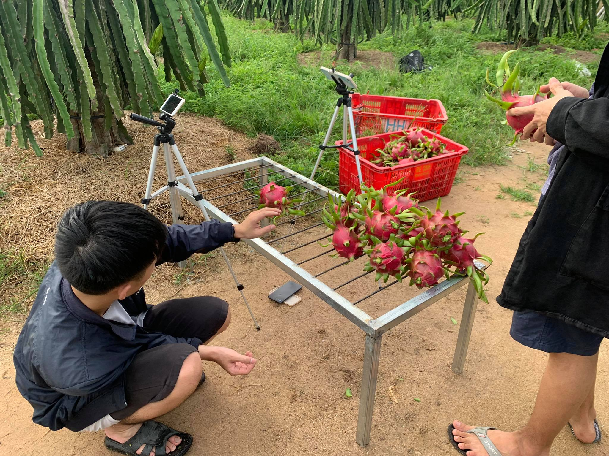
  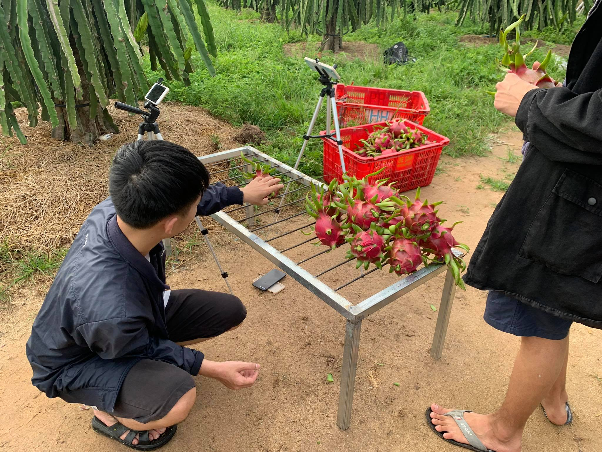

  <em> 3.1. Quá trình thu thập dữ liệu</em>

  

  <em> 3.2. Xuất frames bằng premiere</em>

4. Tiến hành phân chia dữ liệu, có 3 nhãn tương ứng với 3 folder, mỗi folder chứa 3 folder con với mỗi folder trong này chứa ảnh được cắt ra từ camera tương ứng. 

  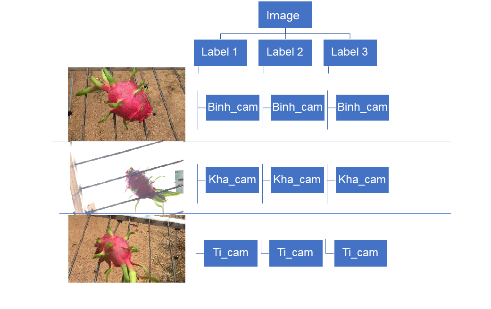

  <em> 3.3. Cấu trúc thư mục chứa dữ liệu</em>

## Gắn nhãn dữ liệu
Trái được cắt đã qua các bước lọc cơ bản như: bỏ trái nhỏ, chưa chín, hư thúi,... bởi nông dân cắt. Và gắn nhãn này là bước phân loại chất lượng hàng để xuất khẩu, được tư vấn bởi chủ vựa.

### Lalel 1 - Loại đẹp 

Thanh long thuộc loại này phải có chất lượng tốt, xét về đặc điểm bên ngoài vỏ thanh long phải đáp ứng các tiêu chí:
- Khuyết tật nhẹ về hình dạng, màu sắc vỏ quả màu đỏ tươi ngoại trừ tai thanh long phải màu xanh lá.
- Khuyết tật nhẹ trên vỏ quả, không nấm bệnh, không đốm do côn trùng.
- Trong mọi trường họp, các khuyết tật không được ảnh hưởng đến thịt quả và không được ảnh hưởng đến chất lượng ngoại quan chung.
- Được phép có đốm đen (vì có thể rửa được).
   

  
  
  

  <em>Trái loại 1 không tì vết</em>

  
  
  

  <em>Trái loại 1 có khuyết tật nhẹ</em>

   
### Label 2 - Loại tiêu chuẩn
Thanh long không thuộc loại 2 sẽ có tiêu chuẩn thấp hơn loại 1:
- Khuyết tật nhẹ về hình dạng, màu sắc vỏ quả màu đỏ tươi ngoại trừ tai thanh long phải màu xanh lá.
- Khuyết tật nhẹ trên vỏ quả. Vẫn không chấp nhận nấm bệnh, không đốm do côn trùng.
- Các khuyết tật không được ảnh hưởng đến thịt quả và được ảnh hưởng mức độ đến chất lượng ngoại quan chung.

  
  
  

  
  
  

  <em>Trái loại 2 có bị ảnh hưởng ngoại quan</em>

   
### Label 3 - Loại xấu
Thanh long thuộc loại này có chất lượng thấp nhất do có quá nhiều khuyết tật trên vỏ
- Tai thanh long bị gãy, bị lem đỏ.
- Có nhiều nấm bệnh, nhiều đốm do côn trùng.
- Vỏ quả có màu sắc sẫm màu hơn loại 1 hoặc phần vỏ không hoàn toàn màu đỏ (ngoại trừ phần tai thanh long).

  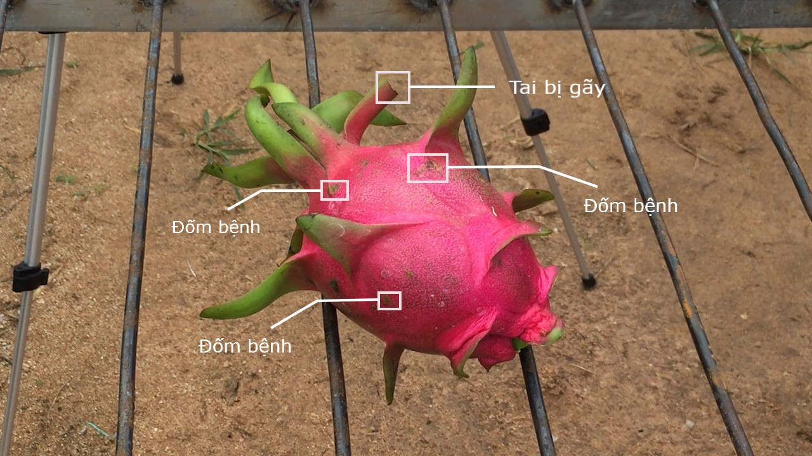
  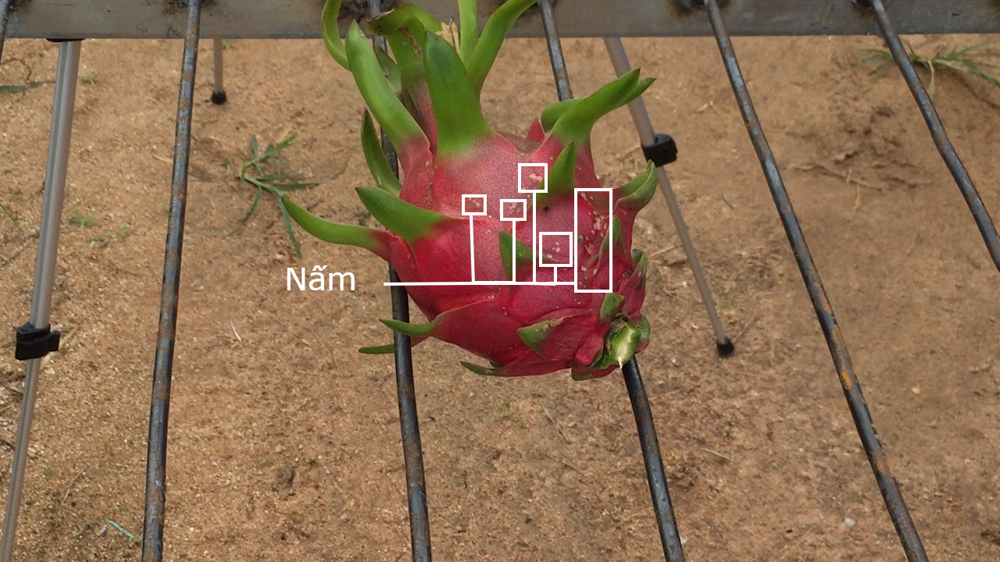 
  

## Tiền xử lý dữ liệu: Sử dụng model Semantic Segmentation

- Sử dụng [labelme](https://github.com/wkentaro/labelme) để viền phần trái và dán nhãn
  

  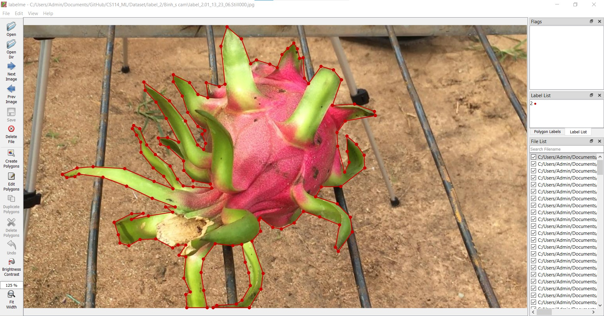
  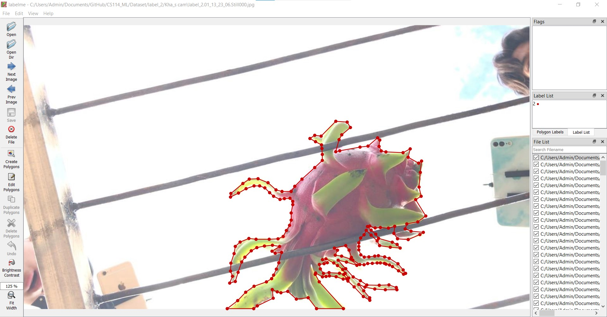 
  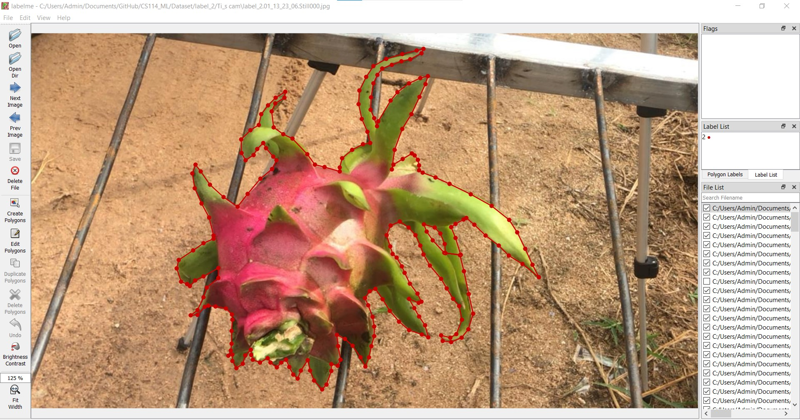

- Sử dụng các loại model Semantic Segmentation huấn luyện, tách phần background và giữ lại phần trái để huấn luyện cho mô hình phân loại

  
   
  

  

## Trường hợp dữ liệu khó xử lý

- Ảnh có chứa ngoại vật xen lẫn vào trái thanh long: tay, thanh sắt lúc chụp từ dưới lên.

  
   
  
  

  <em>Ngoại vật trong trường hợp này là tay người</em>

   
   
    
  

  <em>Ngoại vật trong trường hợp này là thanh sắt của băng chuyền</em>

- Ảnh ở camera thứ hai (Kha_cam) có độ sáng cao hơn 2 ảnh ở camera còn lại do góc chụp từ dưới hướng lên trời.

  

  
  

  <em>Độ sáng của ảnh chụp từ dưới lên cao hơn 2 ảnh chụp ở 2 bên từ trên xuống</em>

## Thông số bộ dữ liệu

Có 3 folder chính được tổ chức, đặt tên giống nhau:
 

### Img

Chứa tất cả ảnh đã gắn nhãn như mô tả trên
- Bộ dữ liệu ban đầu thu thập được khoảng 676 tập dữ liệu trái thanh long (1 tập dữ liệu có 3 ảnh) tương ứng với 2028 ảnh 1280x720x3.
  + 246 tập thuộc label 1
  + 210 tập thuộc label 2
  + 220 tập thuộc label 3
- Dữ liệu sau khi tăng cường bằng cách xoay thủ công trái thanh long trong quá trình quay video thu được khoảng 1120 tập dữ liệu trái thanh long tương ứng với khoảng 3360 ảnh 1280x720x3
  + 406 tập thuộc label 1
  + 412 tập thuộc label 2
  + 301 tập thuộc label 3

  
   
  

  <em>Tăng cường dữ liệu bằng cách xoay chuyển vị trí quả thanh long trên cùng một góc quay</em>

### Json

1299 files chứa nhãn dạng đuôi .json train cho segmentation model để xóa background,   file này sử dụng tool có sẵn trong [labelme](https://github.com/wkentaro/labelme) để decode thành nparray nhị phân 1280x720:
  + 433 file thuộc view Binh_s cam
  + 433 file thuộc view Kha_s cam
  + 433 file thuộc view Ti_s cam
### Crop_mask

Chứa tất cả 3360 ảnh đã gắn nhãn và đã được xóa background (đây là dữ liệu train cho mô hình phân loại) với shape: 320x640x3
  + 406 tập thuộc label 1
  + 412 tập thuộc label 2
  + 301 tập thuộc label 3
### Csv

Chứa 2 loại:
  - Dữ liệu để phân loại, 1119 tập được trộn và chia 3 file csv:
    + train.csv: 782 dòng
    + val.csv: 218 dòng
    + test.csv: 119 dòng

    Cột path chứa đường dẫn ảnh: <em> "img/label.../{}/image_name.jpg" </em> với {} lần lượt 3 tên cameras khi đọc ảnh. Cột y dạng: "label..."

  
  - Dữ liệu để semantic segmentation, 1299 tập được trộn và chia cho 2 file csv:
    + train_mask.csv: 1100 dòng
    + val_mask.csv: 199 dòng

  Cột <strong>"path"</strong> chứa đường dẫn ảnh: <em> "img/label.../cam.../image_name.jpg" </em> . Cột <strong>"label"</strong> dạng: <em> "json/label.../cam.../image_name.json" </em>.

# Chương 4: Training và đánh giá model
## Cấu hình máy:

  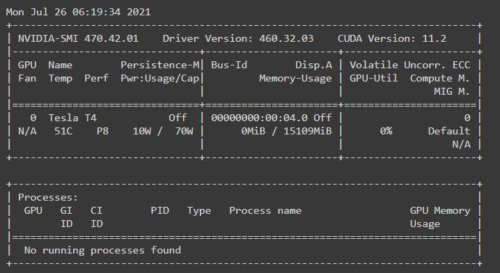

## Model dùng xóa background ảnh (Giai đoạn Preprocessing)
Ứng dụng các nghiên cứu cho bài toán semantic segmentation, nhóm xây dựng và thử nghiệm hai model dựa trên kiến trúc mạng [Unet](https://github.com/milesial/Pytorch-UNet) và [Enet](https://github.com/davidtvs/PyTorch-ENet)

  
  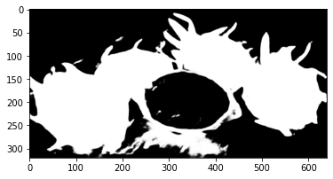
   
  <em>Xác định phần quả thanh long trên khung hình và tách ra khỏi ảnh (xóa background)</em>

### MẠNG UNET

#### 1. Sơ lược mạng Unet
Kiến trúc mạng Unet có 2 phần đối xứng nhau: phần encoder (phần bên trái) và phần decoder (phần bên phải). Trong đó
- Encoder để giảm chiều dài và chiều rộng của ảnh, Encoder thường là các mạng CNN thông thường
- Decoder để khôi phục kích thước ảnh gốc
- Nhóm sử dụng repos có sẵn: [Segmentation Models](https://github.com/qubvel/segmentation_models)

  
   
  <em>Kiến trúc mạng Unet</em>

#### 2. Chi tiết Input, Output và xử lí

##### 2.1 INPUT
gồm 1299 mẫu dữ liệu trộn lẫn của cả 3 camera. Trong đó, 1099 mẫu dùng để training và 200 mẫu dùng cho validation. Một mẫu gồm có:
  - **X_input**: Ảnh quả thanh long gốc shape = [720, 1280, 3] được resize thành [320, 640, 3] (file .jpg)
  - **y_true**: file .json sau khi segment ảnh bằng labelme thu được mảng với shape = [720, 1280] được resize thành [320, 640]

##### 2.2 OUTPUT & XỬ LÍ
  - **y_predict** là np.array mang các giá trị từ [0, 1] với shape = [320, 640, 1] 
  - sau đó apply **y_predict** vào ảnh gốc thu được phần trái đã được xóa background.

#### 3. Thiết lập training

##### 3.1 COMPILE
  - backbone nhóm sử dụng là vgg16 vì thấy ít parameter hơn resnet50 hay các mạng khác.
  - batch_size = 16
  - epoch = 100
  - loss: [jaccard_loss](https://segmentation-models.readthedocs.io/en/latest/api.html#segmentation_models.losses.JaccardLoss), metric: [IOU_score](https://segmentation-models.readthedocs.io/en/latest/api.html#segmentation_models.metrics.IOUScore) có sẵn trong repos [Segmentation Models](https://github.com/qubvel/segmentation_models)

##### 3.2 SUMMARY

Thông số parameter của model:
- Total params: 23,752,273
- Trainable params: 23,748,241
- Non-trainable params: 4,032

#### 4. Kết quả:
Nhận xét: [Colab train](Colab_train/Preprocessing_Unet.ipynb) có chi tiết quá trình từng epoch:

  - Mỗi epoch mất khoảng 96s để train.
  - Loss giảm mạnh trong 5 epochs đầu và bão hòa sau đó, hầu như ko hề giảm
  - Model huyền thoại này khá ổn, với số lượng data tương đối nhiều, kết quả tốt. 
  - Nhóm thử predict trên batch 16 tấm, model xử lí trong khoảng 0.797s => khoảng 20fps. 

  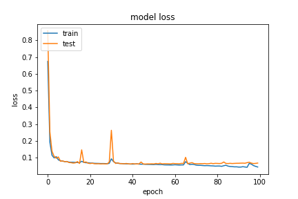
  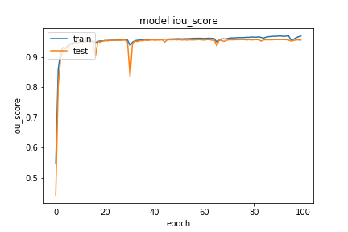
   
  <em>Đồ thị loss value và iou score của model</em>

#### 5. Demo

  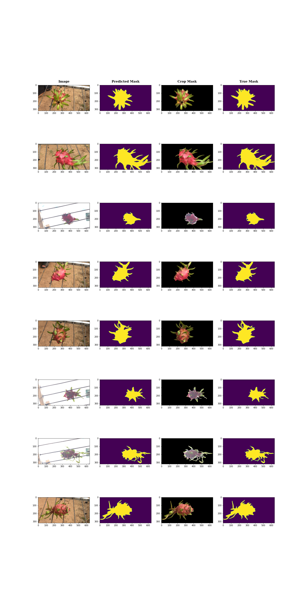

### Mạng Enet
#### 1. Sơ lược mạng ENet

****ENet (Efficient Neural Network)*** có khả năng phân khúc ảnh qua pixel theo thời gian thực. ENet nhanh hơn đến 18 lần, yêu cầu FLOP (Floating Point Operation Per Second) ít hơn 75 lần và số lượng tham số (parameters) ít hơn 79 lần cho độ chính xác gần tương đương so với các mô hình hiện có (năm 2016). Số liệu trên có được qua các thử nghiệm trên bộ dũ liệu CamVid, Cityscapes và SUN (nguồn: [ENet: A Deep Neural Network Architecture for Real-Time Semantic Segmentation](https://arxiv.org/abs/1606.02147))

#### 2. Chi tiết datasets
Sau khi xem xét bộ dữ liệu, nhận thấy ánh sáng các ảnh trong folder *"Kha_cam"* có độ sáng mạnh hơn các ảnh ở 2 folder còn lại, mà mạng Enet có số lượng parameter ít hơn Unet rất nhiều nên rất khó trích xuất chính xác đặc trưng. Vì vậy, để tăng độ chính xác nhóm quyết định train 2 model cho 2 trường hợp dữ liệu.
- Một model (**Enet_2cam**) dành cho ảnh chụp bởi 2 camera ở 2 bên có góc nhìn từ trên xuống.
- Một model (**Enet_midcam**) dành cho ảnh chụp bởi camera chụp từ dưới lên.

**Bộ dữ liệu cho model Enet_2cam**: Gồm tổng cộng 433 mẫu dữ liệu. Trong đó, có 361(≈83%) mẫu dùng để training và 72(≈17%) tập dùng cho validation.

**Bộ dữ liệu cho model Enet_midcam**: Gồm tổng cộng 866 mẫu dữ liệu. Trong đó, có 738 (≈85%) mẫu dùng để training và 128(≈15%) tập dùng cho validation.

*Mỗi mẫu dữ liệu bao gồm:*
- **X_input**: Ảnh quả thanh long gốc shape = [720, 1280, 3] được reshape thành [320, 640, 3] (file .jpg)
- **y_true**: file .json sau khi segment ảnh bằng labelme thu được mảng với shape = [720, 1280] được reshape thành [320, 640]

Output y_predict là np.array có shape [320,640,2] 

#### 3.Thiết lập training

- Batch size = 32
- Loss sử dụng hàm cross entropy loss
- optimizer là Adam
- Learning rate = 0.0005

#### 4. Kết quả

  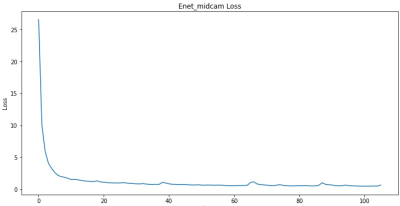
  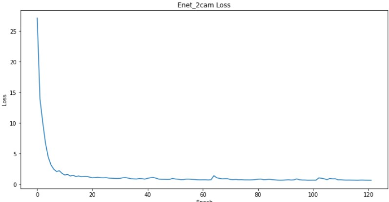
   
  <em>Đồ thị loss value của hai model</em>

#### 5. Demo

**Model Enet_midcam**

  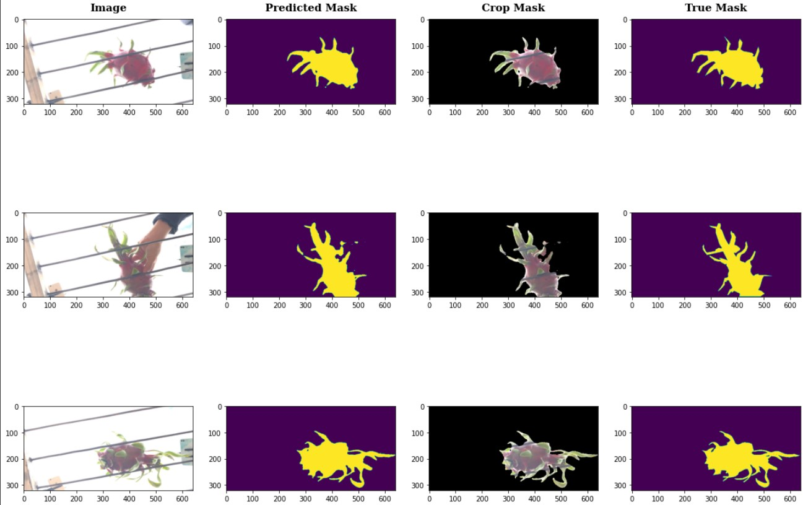

**Model Enet_2cam**

  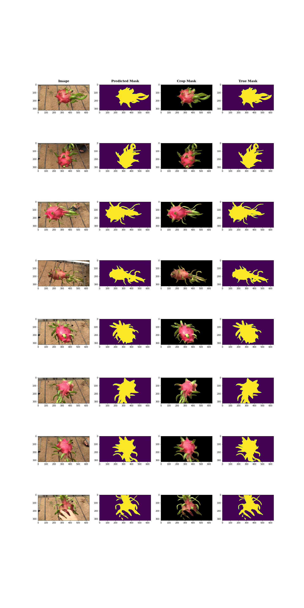

***Kết luận***

Unet chính xác hơn Enet nhưng tốc độ xử lý và tài nguyên tiêu hao lớn hơn Enet (tính toán hơn 20 triệu parameter so với 300 nghìn parameter của Enet). Tuy vậy, Unet chỉ chính xác hơn Enet một tí và thời gian xử lý 16 ảnh mất 0.797 giây (trong khi Enet xử lý chỉ mất 0.06 giây)
## Classify Model
Trong quá trình thử nghiệm các model, nhóm đánh giá 2 trường hợp trước và sau khi tăng thêm dữ liệu. Do quá trình training giai đoạn một mô hình có độ chính xác không cao và có dấu hiệu overfitting nên nhóm tăng thêm dữ liệu theo cách đã được trình bày ở phần ***Chi tiết bộ dữ liệu***
Bộ dữ liệu sử dụng cho các model:
- Giai đoạn 1 (trước khi tăng cường dữ liệu): gồm 858 tập dữ liệu tương ứng với 2574 ảnh quả thanh long ở các góc chụp khác nhau (1 tập = 3 ảnh ở 3 góc chụp). 858 tập được chia ra như sau:
  - 606 tập để training (≈71%)
  - 167 tập để validation (≈19%)
  - 85 tập để test (≈10%)
- Giai đoạn 2 (sau khi tăng cường dữ liệu): gồm 1119 tập dữ liệu tương ứng với 3357 ảnh quả thanh long ở các góc chụp khác nhau
  - 782 tập để training (≈70%)
  - 218 tập để validation (≈19%)
  - 119 tập để test (≈11%)

Không như các bài toán phân loại hay nhận dạng thông thường. Vấn đề của bài toán là phân loại dựa thông tin ở 3 góc nhìn khác nhau => Bài toán phân loại dựa trên 3 góc. Vậy nhóm nghĩ ra phương pháp (sau này mới tìm và thấy đã có bài báo, pp tên là Multi-view CNN).

  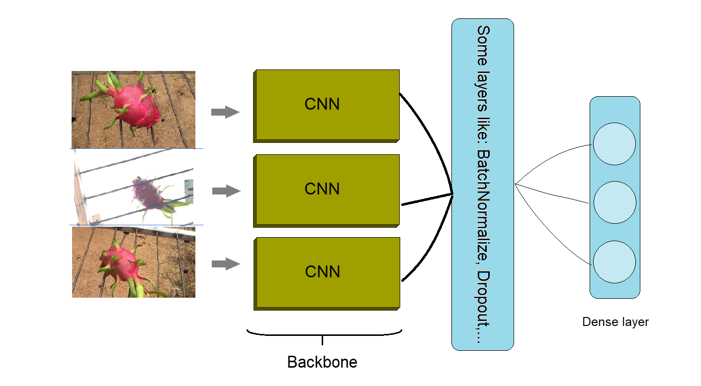
  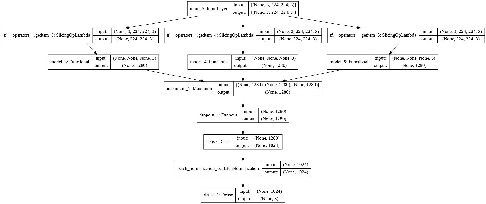
   

### I/ BACKBONE: Inception ResNet v2
Inception-ResNet-v2 là một kiến trúc nơ-ron tích chập được xây dựng dựa trên họ kiến trúc Inception nhưng kết hợp các kết [Residual Connection](https://paperswithcode.com/method/residual-connection). Chi tiết : [Inception ResNet v2](https://paperswithcode.com/model/inception-resnet-v2?variant=inception-resnet-v2-1)

### II/ ResNet 50
[ResNet (Residual Network)](https://en.wikipedia.org/wiki/Residual_neural_network) được giới thiệu đến công chúng vào năm 2015 và thậm chí đã giành được vị trí thứ 1 trong cuộc thi ILSVRC 2015 với tỉ lệ lỗi top 5 chỉ 3.57%. Không những thế nó còn đứng vị trí đầu tiên trong cuộc thi ILSVRC and COCO 2015 với ImageNet Detection, ImageNet localization, Coco detection và Coco segmentation.Hiện tại thì có rất nhiều biến thể của kiến trúc ResNet với số lớp khác nhau như ResNet-18, ResNet-34, ResNet-50, ResNet-101, ResNet-152,...Với tên là ResNet theo sau là một số chỉ kiến trúc ResNet với số lớp nhất định.

  
   
  <em>Kiến trúc ResNet bao gồm 2 khối đặc trưng là khối tích chập (Conv Block) và khối xác định (Identity Block).</em>

Nhìn chung ResNet cũng gần như tương tự với các mạng gồm có convolution, pooling, activation và fully-connected layer. ResNet sử dụng các kết nối "tắt" đồng nhất để xuyên qua một hay nhiều lớp

### III/ MobileNetV2
Kể từ khi ra đời, MobileNetV2 là một trong những kiến trúc được ưa chuộng nhất khi phát triển các ứng dụng AI trong computer vision bởi độ chính xác và hiệu năng tính toán. MobileNetV2 cũng sử dụng những kết nối tắt như ở mạng ResNet. Tuy nhiên kết nối tắt ở MobileNetV2 được điều chỉnh sao cho số kênh (hoặc chiều sâu) ở input và output của mỗi block residual được thắt hẹp lại. Chính vì thế nó được gọi là các bottleneck layers. (Nguồn: [MobileNetV2: Inverted Residuals and Linear Bottlenecks](https://arxiv.org/abs/1801.04381))

  
   
  <em>Tổng quan về Kiến trúc MobileNetV2. Các block màu xanh đại diện cho các convolutional building blocks như hình trên.</em>

### Thiết lập training
  
  - Weight sử dụng là "imagenet"
  - optimizer: "Adam"
  - loss: "categorical_crossentropy"
  - metrics: "accuracy"
  - kĩ thuật: fine tuning
    + freeze: giữ weigth của backbone lại. chỉ train các layer còn lại
    + trainAll: unfreeze backbone và train tất cả

### IV/ Đánh giá các model
#### Giai đoạn 1

- InceptionResNetv2: mạng có độ phức tạp cao nên loss accuracy tốt nhất trong 3 mạng, nhưng vẫn bị overfitting. 
- Resnet50: mạng độ phức tạp vừa, parameter nhiều hơn so với MobileNet nhưng hiệu suất thì ko tốt. Train tốt tài nguyên hơn nhưng hiệu suất thua Mobile.
- MobileNetv2: mạng nhỏ con nhưng xịn, với cấu trúc bottle neck trích xuất đặc trưng tốt. Nhỏ nhẹ mạnh, tuy nhiên giống như InceptionResNetv2, vẫn bị overfitting.
- Train All cho thấy loss tập train giảm nhưng val thì ko giảm bao nhiêu. Nhóm kết luận là data quá ít, ko đủ cho mô hình học 

  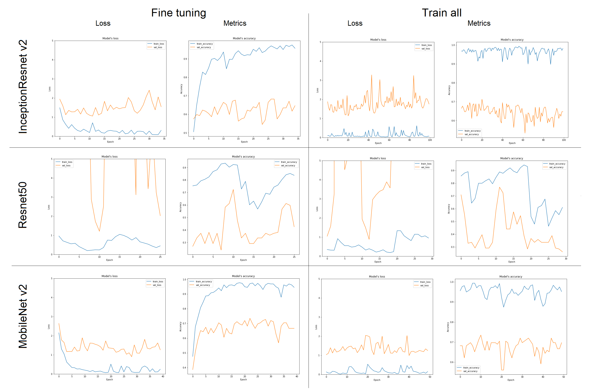
   
  <em>Chart so sánh performance các model.</em>

#### Giai đoạn 2
- InceptionResNetv2: model này cho thấy rõ hiện trạng của dataset. Fine tuning, chỉ train các dense layer. Loss train, loss val gần như bằng nhau. Sau khi unfreeze, chỉ mỗi loss train giảm, val loss giảm ít. Cho thấy loss giảm là do mô hình "quá tốt". Vẫn bị overfitting, cần thêm data.
- MobileNetv2: cũng tương tự InceptionResNetv2, mạng nhỏ hơn nhưng vẫn overfitting. 

  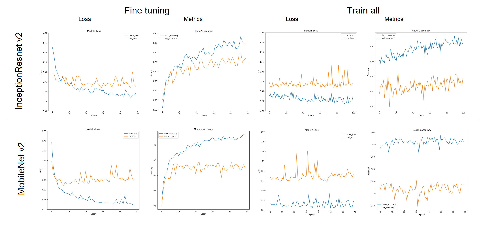
   
  <em>Chart so sánh performance các model.</em>

- Metrics của 2 model cũng ko hơn kém gì nhau bao nhiêu. Tuy nhiên, InceptionResNetv2 có số lượng parameters nhiều gấp khoảng 21 lần so với model MobileNetv2 (164,609,699 parameters so với 8,108,227 parameters). Vì vậy, thời gian train và test MobileNetv2 nhanh hơn nhiều so với InceptionResNetv2.

  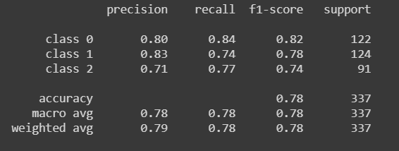
  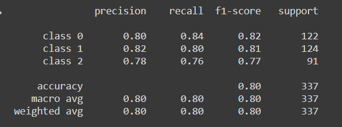
   
  <em>Metrics của MobileNetv2 (trên) và InceptionResnetv2 (dưới).</em>

- Check kĩ từng class ta thấy, MobileNet sai ở class 1 và class 2 nhiều.

  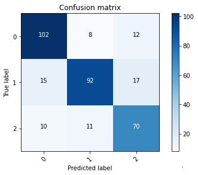
  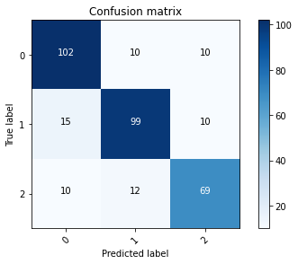
   
  <em>Confusion matrix của MobileNetv2 (trái) và InceptionResnetv2 (phải).</em>

- Demo nhãn dự đoán và nhãn thực tế của hai mô hình (InceptionResnetv2 - phải và MobileNetv2 - trái):

  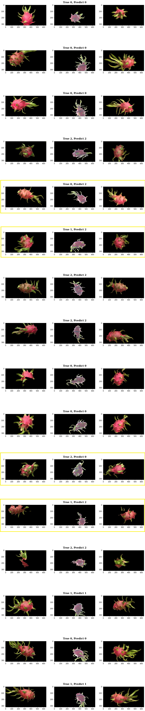
  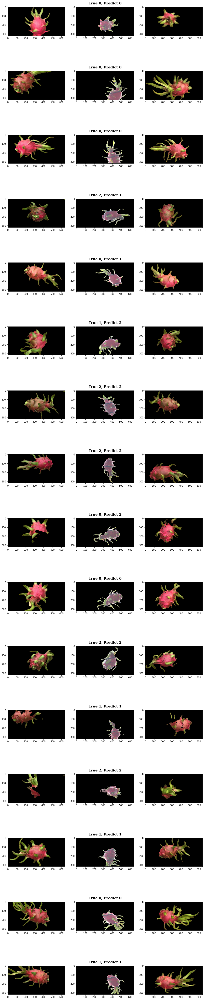

Qua quan sát sơ bộ, nhóm đưa ra một số lý do khiến cho mô hình dự đoán sai ở một vài trường hợp:
- MobileNetv2 nhận diện các chi tiết nhỏ kém hơn InceptionResnet nên thường dự đoán sai class 1 và 2
- InceptionResNetv2 nhận diện các chi tiết tốt hơn nên thường nhận diện các quả thanh long bị khuyết một phần sang class 2 (lý do khuyết: ảnh chứa tay nên bị cắt đi)
- Sự thiếu đồng bộ về ánh sáng của ảnh đặc biệt camera thứ 2 sáng hơn 2 camera còn lại. Ánh sáng cao cũng làm mờ các khuyết tật của trái và làm thay đổi màu sắc của quả trên ảnh

**So sánh hai model**
| Tiêu chí đánh giá | InceptionResNetv2 | MobileNetv2 |
| :---: | --- | --- |
| Tốc độ xử lý (Thời gian train (mỗi epoch) - test trung bình (16 tấm))| 36s - 0.64s | 16s - 0.16s |
| Độ chính xác | accuracy 80% trên bộ test, f1-score cao hơn vài phần trăm ở tất cả các class| accuracy 78% trên bộ test, f1-score thấp hơn |

***Kết luận***
InceptionResNetv2 cho độ chính xác cao hơn MobileNetv2 khoảng 2% - 5% trên cùng bộ test nhưng thời gian xử lý lại cần nhiều hơn. Tổng thể MobileNetv2 tốt hơn khá nhiều so với InceptionResNetv2.
# Chương 5: Ứng dụng và hướng phát triển
## Ứng dụng
Như đã nêu ở phần I, mục đích ứng dụng của mô hình trên nhằm hướng đến các vựa thanh long và các nhà máy thu mua thanh long. Giúp cho các doanh nghiệp tự động hóa khâu phân loại ngay sau khâu rửa thanh long mà không cần dùng nhiều nhân lực vận hành .Tuy nhiên, việc phân loại cho xuất khẩu cần độ chính xác và năng suất cực cao nên model cần cải tiến rất nhiều về tốc độ xử lý và khả năng xử lý (phân loại nhiều quả trên khung hình, tốc độ băng chuyền nhanh,...)
## Hướng phát triển
### Dữ liệu:
- Cần nhiều dữ liệu về các giống thanh long khác nhau nhằm tăng sự đa dạng về sản phẩm cũng như giúp model nhận diện các đặc trưng riêng cho từng loại tốt hơn.
- Cải thiện môi trường thu thập dữ liệu sát với thực tế (điều kiện ánh sáng trong nhà)
- Cải thiện cách tăng cường dữ liệu bằng các phương thức như random crop (cắt ngẫu nhiên), rotation (xoay), information loss (mất thông tin)... thay vì xoay thủ công như đã trình bày ở trên.
- Cải thiện và bổ sung các phuong pháp khác trong quá trình pre-processing dữ liệu
### Model:
- Thử nghiệm một vài cách tiếp cận xây dựng model mới tham khảo bài toán tương tự như [Steel Defect Detection](https://www.kaggle.com/c/severstal-steel-defect-detection) và từ đó phát triển mô hình trên giúp cho mô hình nắm bắt tốt các khuyết tật của quả thanh long
- Thử nghiệm một số model khác cũng như nghiên cứu thêm thông tin về các thông số ảnh hưởng thế nào đến các bộ dữ liệu khác nhau nhằm đưa ra cách điều chỉnh phù hợp.
